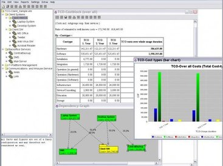

coming soon..

# Use cases

Model your own situation (personal and infrastructure cost-drivers), for e.g.:

* Sample 

Legacy website:

* [index en](website/index_en.html)
* [index de](website/index.html)

# Technical aspects

Define log-level in tco-tool-core/src/main/resources/logback.xml